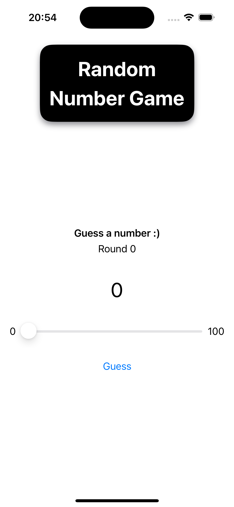
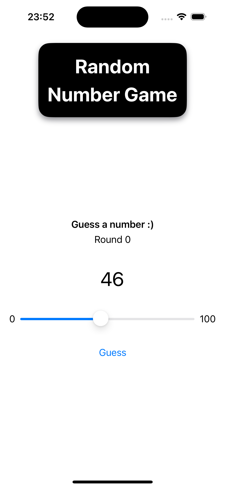
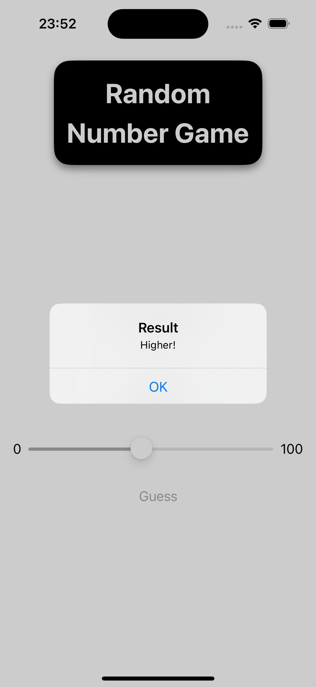
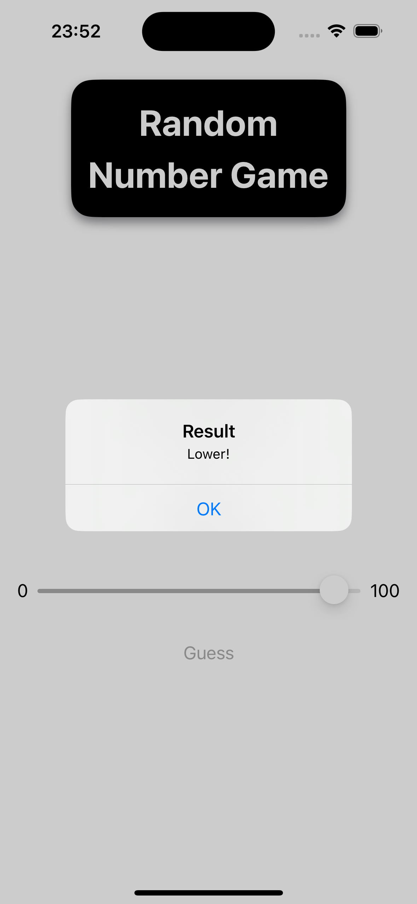
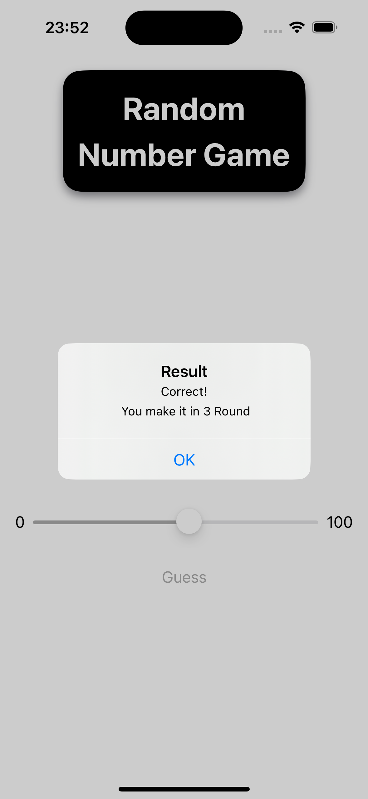
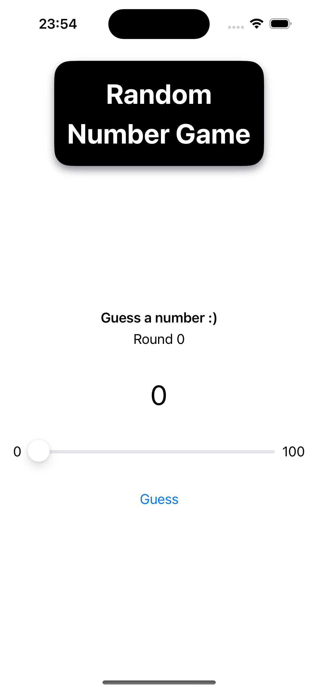

6410685033 Thammasat Thonggamgaew

# CN436_AS1: Random Number Game

An iOS Random Number Game
[Demo Clip]()

## Table of Contents

- [Random Number Game](#cn436_as1-random-number-game)
  - [Table of Contents](#table-of-contents)
  - [Objective](#objective)
  - [How to play](#how-to-play)
  - [Contact](#contact)

## Objective
- Player will **guess** the number until they get the correct number.
- Player will get a **hint message** from the game if they guess the incorrect number
- When player guess the correct number, the game will show the message that tell the number of guesses

The **hint message** tells the player whether the guessed number is higher or lower than the correct (target) number.

### How to play

- In the beginning, the game will generate a random integer that player will have to guess.

- Player can scroll the slider to increase/decrease the number that you want to guess. Once you're ready, Click `Guess` to submit the answer.

- The game will pop up the message to tell the player whether the guessed number is higher or lower than the correct (target) number.

- Once the player submits the correct number, the game will display a message confirming their success along with the total number of guesses made.

- After click OK, the game will reset and the player can play again.

### Contact
- Thammasat Thonggamgaew (Pond)
- Tel: (+66) 087 704 4428
- Email: pond.thammasat@gmail.com
- University Email: thammasat.tho@dome.tu.ac.th
- Faculty Email: 6410685033@student.tu.ac.th